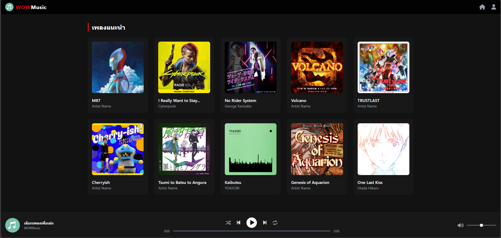

# 🎵 WowMusic

**YouTube Music-inspired Web Player**
A freshman-year project featuring custom UI design and seamless audio streaming integrated with Google Drive storage.

โปรเจกต์แอปพลิเคชันฟังเพลงออนไลน์ที่ได้แรงบันดาลใจจาก YouTube Music พัฒนาด้วย Vanilla JavaScript (Frontend ล้วน) โดดเด่นด้วยการออกแบบ UI ที่ทันสมัยและโต้ตอบกับผู้ใช้ได้เป็นอย่างดี ตัวแอปเชื่อมต่อระบบเล่นเพลงเข้ากับพื้นที่จัดเก็บข้อมูลบน Google Drive พร้อมเสริมความปลอดภัยด้วยการใช้ API ตัวกลางในการจัดการ Secret Key ทำให้สถาปัตยกรรมแบบ Client-Side Only มีความปลอดภัยและใช้งานได้จริง"

## 💡***เป็นโปรเจคเพื่อศึกษาการดึงข้อมูลผ่าน API และแสดงผลผ่าน html+javascript และตกแต่งด้วย tailwind เท่านั้น***💡

## ✨ Features (คุณสมบัติเด่น)

* **Modern Dark UI:** ดีไซน์ธีมมืด (Dark Mode) สไตล์มินิมอล พร้อม Accent สีแดงและเอฟเฟกต์ลูกเล่น (Hover/Transitions) ที่นุ่มนวล
* **Seamless Audio Streaming:** สตรีมเพลงแบบเรียลไทม์ผ่าน Custom API ที่ทำการดึงไฟล์เสียงโดยใช้ Google Drive ID
* **Full Player Controls:** แผงควบคุมการเล่นเพลงที่ใช้งานได้จริง ครอบคลุมฟังก์ชัน:
  * เล่น / หยุดชั่วคราว (Play / Pause)
  * เล่นซ้ำ (Loop)
  * สุ่มเพลง (Shuffle)
* **Interactive Media Bars:** * **Progress Bar:** แถบแสดงเวลาของเพลงที่สามารถกดหรือลากเพื่อข้ามเวลา (Seek) ได้อย่างแม่นยำ
  * **Volume Control:** แถบปรับระดับเสียง พร้อมปุ่มเปิด-ปิดเสียง (Mute) อย่างรวดเร็ว
* **Responsive Design:** รองรับการแสดงผลทุกขนาดหน้าจอ ทั้งบนคอมพิวเตอร์และโทรศัพท์มือถือ
* **Info Modal:** ป๊อปอัปหน้าต่างแสดงข้อมูลผู้พัฒนา พร้อมช่องทางการติดต่อ

## 🛠️ Technologies Used (เทคโนโลยีที่ใช้)

* **Core:** HTML5, CSS3, Vanilla JavaScript (ES6+)
* **Styling Framework:** Tailwind CSS (v3.4.17)
* **Icons:** FontAwesome (v6.2.0 - Sharp Solid)
* **Data Integration:** Fetch API สำหรับดึงข้อมูล Audio Blob แบบ Asynchronous
